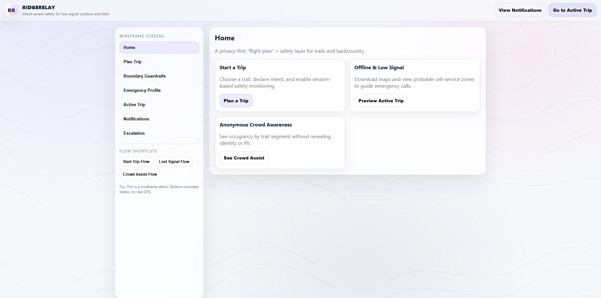
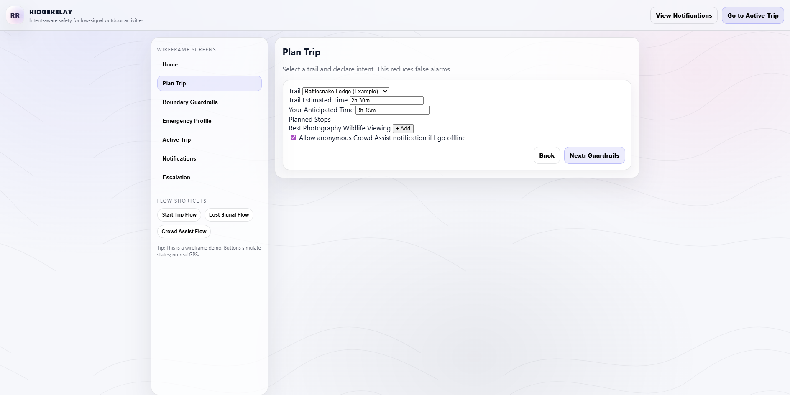
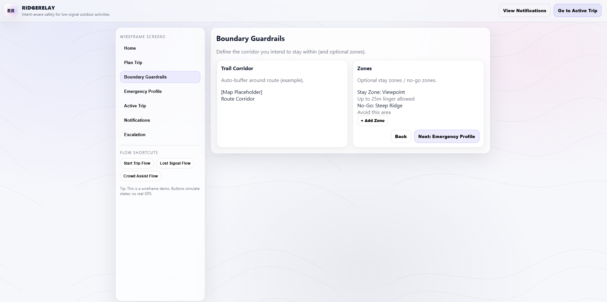
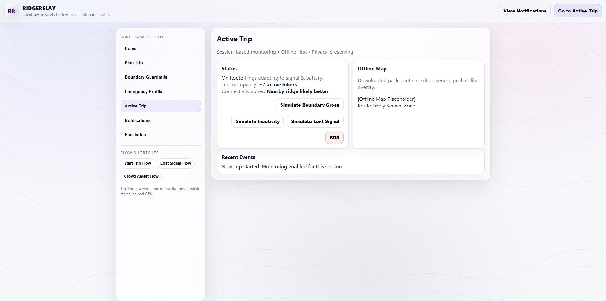
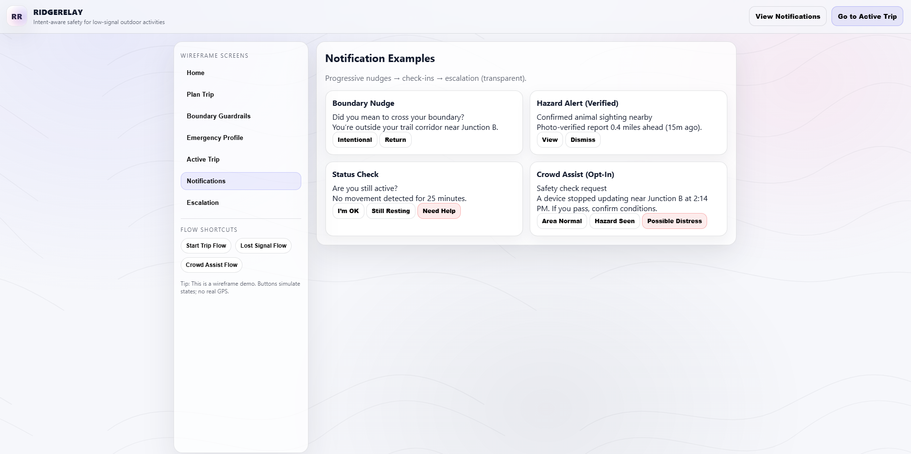

# RidgeRelay — Intent-Aware Outdoor Safety (Wireframe)
 
RidgeRelay is a **privacy-first outdoor safety platform concept** designed for low- or no-cell-signal environments.

This repository contains a **clickable wireframe prototype** demonstrating core safety flows, intent-aware notifications, and staged escalation logic.

> This is not a fitness or social app.  
> RidgeRelay is a digital *flight plan* and safety layer for remote outdoor activity.

---

## How to Explore This Project

1. Start with `PROJECT_BRIEF` for goals, constraints, and evaluation criteria
2. Read `DIFFERENTIATION.md` for how RidgeRelay differs from existing tools
3. Review `ARCHITECTURE.md` for system thinking and staged escalation design
4. Browse `RESOURCES.md` for potential integrations (maps, weather, etc.)
5. Explore the live demo:
   - Clean view: https://jamdanie.github.io/RidgeRelay/
   - Dev grid view: https://jamdanie.github.io/RidgeRelay/?dev=1 (press **G**)

## Documentation

The `/docs` directory contains supporting materials (screenshots, diagrams, and notes)
used to explain RidgeRelay’s design decisions beyond the interactive wireframe.

---

## The Problem

Most outdoor safety today relies on:
- informal plans left with family
- apps that assume constant connectivity
- alerts triggered only *after* a missed check-in

When things go wrong, responders often lack:
- clear user intent
- accurate last-known context
- early warning signals before escalation

Many incidents escalate silently before anyone knows there’s a problem.

---

## The RidgeRelay Concept

RidgeRelay allows users to:

- **Declare intent before starting**
  - route or trail
  - expected duration
  - planned stops and stay zones
- **Define route boundaries and guardrails**
- **Enable session-based, temporary safety monitoring**
- **Receive intent-aware safety notifications**
- **Use offline maps with probable cellular service zones**
- **Leverage anonymous crowd awareness**
  - no identities or PII shared
- **Escalate emergencies predictably and transparently**

Designed for hikers, runners, hunters, and backcountry users.

---

## Core Features (Wireframe)

- Intent-based trip planning  
- Boundary guardrails and stay zones  
- Offline maps + connectivity probability overlay  
- Intent-aware notifications and check-ins  
- Anonymous trail occupancy  
- Opt-in crowd assist safety signals  
- Staged emergency escalation  
- Opt-in emergency profile (shared only during escalation)

---

## Privacy & Trust Model

RidgeRelay is intentionally designed to avoid surveillance.

- No always-on tracking  
- Session-limited permissions  
- No persistent location history  
- Emergency-only data disclosure  
- Anonymous participation by default  

Tracking **automatically ends** when the trip ends or the user exits the trail.

---

## What This Repo Is (and Isn’t)

**This repo is:**
- a safety-first UX and systems design prototype
- a demonstration of intent-aware escalation logic
- an exploration of privacy-by-design in remote environments

**This repo is not:**
- a production system
- a live GPS tracker
- a social or fitness platform
- connected to real emergency services

---

## Why This Matters

Many outdoor injuries and fatalities are not caused by instant catastrophe, but by:
- unnoticed deviation
- prolonged inactivity
- delayed awareness
- lack of context when escalation finally occurs

RidgeRelay is designed to **shorten the gap between “something feels off” and “someone knows and can help”**—without sacrificing user trust or privacy.

---

## Status

This is an **early-stage concept and wireframe**, built to explore:
- intent-aware safety modeling
- progressive escalation
- trust and privacy tradeoffs
- real-world rescue constraints

## Screenshots (Design Reference)

These screenshots capture key wireframe states and intent-aware safety flows.
They are provided for design review, discussion, and documentation — not marketing.

### Home / Overview

### Plan Trip (Intent Declaration)

### Boundary Guardrails

### Active Trip (Offline + Status)

### Notifications & Escalation

Recommended views:
- Home / Overview
- Plan Trip (intent declaration)
- Boundary Guardrails
- Active Trip (status + offline context)
- Notifications & Escalation

Feedback and discussion are welcome.
